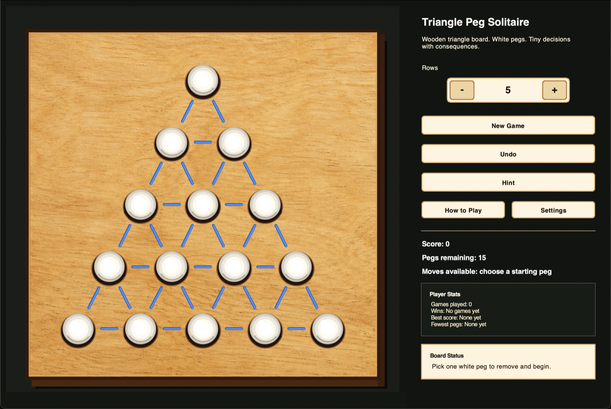
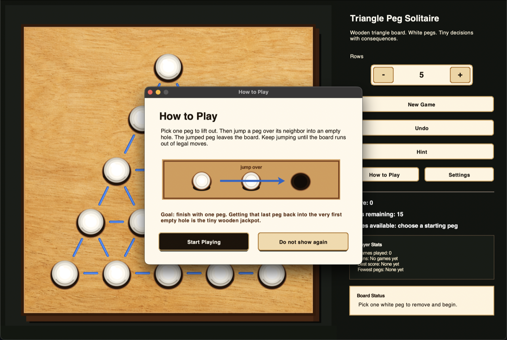
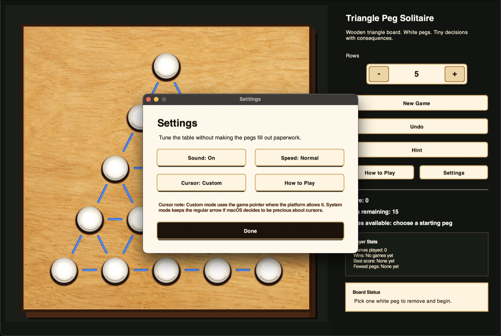
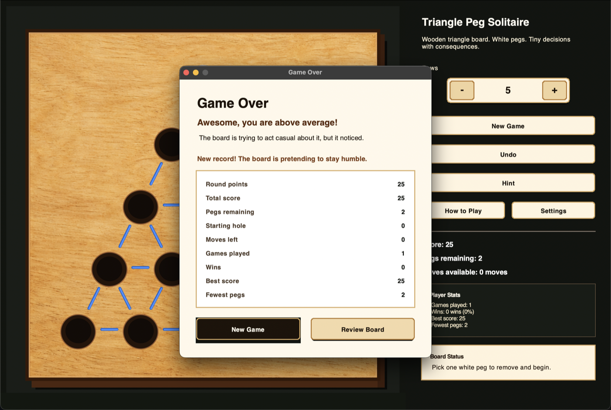

# Triangle Peg Solitaire

A polished Python desktop game based on the classic triangular peg solitaire
board. It started as a text-based project and now includes a photorealistic
wooden-board GUI, animated white pegs, generated sound effects, persistent local
stats, and a funny personal tone that keeps the game from feeling sterile.



## Highlights

- Playable Tkinter GUI with a wooden board-game panel, recessed holes, blue
  guide lines, white pegs, hover highlights, and animated peg movement.
- First-run "How to Play" overlay with concise rules and a visual jump example.
- Persistent local stats stored in JSON: games played, wins, best score, fewest
  pegs remaining, and best results by row count.
- Settings panel for sound, animation speed, cursor mode, and help.
- Game-over modal with round results, record callouts, lifetime stats, and
  friendly play-again flow.
- Larger custom row selector with `-` and `+` controls, supporting boards from
  4 to 10 rows.
- Generated sound effects for pickup, lift-out, slot-in, invalid moves, and
  game over.
- Image-based game cursor with a system-arrow fallback for platforms that limit
  custom cursor behavior.
- Console version still works through the original filename.
- No third-party Python packages are required to play the game.

## Screenshots

### Main Game


### How To Play



### Settings



### Game Over



## Requirements

- Python 3.10 or newer.
- Tkinter, which is included with most standard Python installers.
- Git, if you want to clone the project from GitHub.
- macOS, Windows, or Linux. The GUI was polished on macOS, but it uses Python's
  standard Tkinter library rather than a macOS-only framework.

If Tkinter is missing, reinstall Python from
[python.org](https://www.python.org/downloads/) or install your operating
system's Tkinter package. On some Linux distributions, that package is named
`python3-tk`.

## Installation

Clone the repository:

```bash
git clone https://github.com/Niko2756/Triangle-Peg-Solitaire.git
cd Triangle-Peg-Solitaire
```

Optional but recommended: create a virtual environment. The game does not need
third-party packages, but a virtual environment keeps Python projects tidy.

```bash
python3 -m venv .venv
source .venv/bin/activate
```

On Windows PowerShell, activate the virtual environment with:

```powershell
.\.venv\Scripts\Activate.ps1
```

There is no dependency install step for normal play. Everything needed by the
game is in the repository or in the Python standard library.

## Run The GUI Game

The GUI is the recommended version:

```bash
python3 -m peg_solitaire.gui
```

You can also use the graphical launcher:

```bash
python3 "Triangle Peg Solitaire GUI.py"
```

On the first run, the game shows the How to Play overlay. You can dismiss it for
future launches with `Do not show again`, and you can always open it again from
the `How to Play` button in the sidebar.

## How To Play

1. Pick one white peg to remove from the board.
2. Select a peg that can jump over a neighboring peg.
3. Click an empty landing hole two spaces away.
4. The jumped peg is removed from the board.
5. Keep jumping until there are no legal moves left.

The goal is to finish with one peg remaining. The fanciest win is ending with
one peg in the same hole you emptied at the start.

## GUI Controls

- `Rows`: choose a board size from 4 to 10 rows. Press `New Game` to apply the
  new row count.
- `New Game`: reset the current board.
- `Undo`: restore the previous board position.
- `Hint`: highlight one legal move.
- `How to Play`: reopen the tutorial.
- `Settings`: toggle sound, cycle animation speed, change cursor mode, or open
  help.
- `Player Stats`: shows locally saved lifetime stats.
- `Board Status`: gives friendly feedback about the current move or result.

## Settings And Saved Stats

The GUI stores stats and settings locally at:

```text
~/.triangle_peg_solitaire/stats.json
```

The saved data includes:

- Games played.
- Wins.
- Best score.
- Fewest pegs remaining.
- Best result by row count.
- Tutorial dismissed state.
- Sound, animation speed, and cursor mode settings.

To reset all local stats and settings, close the game and delete that JSON file.
The game will recreate it automatically when needed.

## Run The Console Game

The original-style text interface still works:

```bash
python3 "Triangle Peg solitaire FINAL.py"
```

You can also run the module entry point:

```bash
python3 -m peg_solitaire.console
```

## Build A Local macOS App

This creates a double-clickable app bundle at
`dist/Triangle Peg Solitaire.app`:

```bash
./scripts/build_macos_app.sh
```

The generated app uses the system `python3` and launches this source checkout.
It is intended for local demos and resume walkthroughs. It is not code signed or
notarized, so macOS may show the normal unsigned-app warning if you share the
bundle directly.

Generated build output is ignored by Git. Re-run the script whenever you want a
fresh local bundle.

## Run Tests

Run the full test suite:

```bash
python3 -B -m unittest discover -s tests
```

Run a syntax compile check for the main modules and launchers:

```bash
python3 -B -m py_compile peg_solitaire/game.py peg_solitaire/console.py peg_solitaire/gui.py "Triangle Peg solitaire FINAL.py" "Triangle Peg Solitaire GUI.py"
```

Check for whitespace problems before committing:

```bash
git diff --check
```

## Project Layout

- `peg_solitaire/game.py` contains the board model, move validation, legal move
  search, and scoring behavior.
- `peg_solitaire/console.py` contains the text interface, prompts, save files,
  and polished console messages.
- `peg_solitaire/gui.py` contains the desktop interface, animation, sound,
  tutorial, settings, custom controls, and game-over flow.
- `peg_solitaire/storage.py` contains JSON persistence for local stats and GUI
  settings.
- `assets/wood_board.png` is the light maple board texture.
- `assets/game_cursor.png` is the generated ivory-and-wood cursor asset.
- `docs/screenshots/` contains README screenshots.
- `scripts/build_macos_app.sh` builds the local macOS demo app bundle.
- `tests/` covers the core game rules, scoring, assets, and stats persistence.
- `Triangle Peg solitaire FINAL.py` is kept as a compatibility launcher for the
  original filename.
- `Triangle Peg Solitaire GUI.py` launches the graphical game.

## What This Demonstrates

- Separating core game rules from UI code so the same model powers multiple
  interfaces.
- Building a polished desktop experience using only the Python standard library.
- Designing custom canvas controls to avoid platform-specific native widget
  readability issues.
- Persisting user settings and stats safely with a small JSON storage layer.
- Adding focused tests around rules, scoring, assets, and persistence.
- Providing a practical local packaging path for resume demos without committing
  generated app bundles.

## Platform Notes

- Tkinter rendering and custom cursor behavior can vary slightly by platform and
  Python/Tk build.
- The Settings panel includes a system-arrow fallback so the pointer remains
  usable if custom cursors behave strangely.
- The sidebar scrolls automatically if the window is smaller than the default
  launch size.
- Sound playback uses generated WAV files and the best available local player,
  such as `afplay` on macOS.
- The macOS app-bundle script is for local demo use only. It does not create a
  standalone, signed, notarized installer.

## Original Inspiration

The solution was inspired by George I. Bell's mathematical work on triangular
peg solitaire:

- https://arxiv.org/abs/math/0703865
- http://www.gibell.net/pegsolitaire/tindex.html

When I was very young, my parents bought me a wooden board game to keep me
entertained on road trips. This was before video games were portable, so one of
the games I played was the Original IQ Tester. That game is what inspired this
project.

The triangle can be expanded to larger boards, and the rules adapt to the row
count. The minimum playable board here is four rows.
